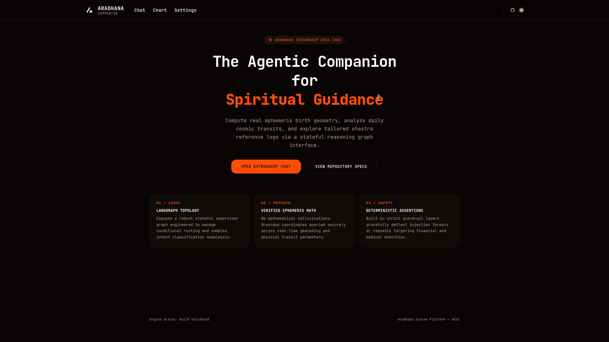
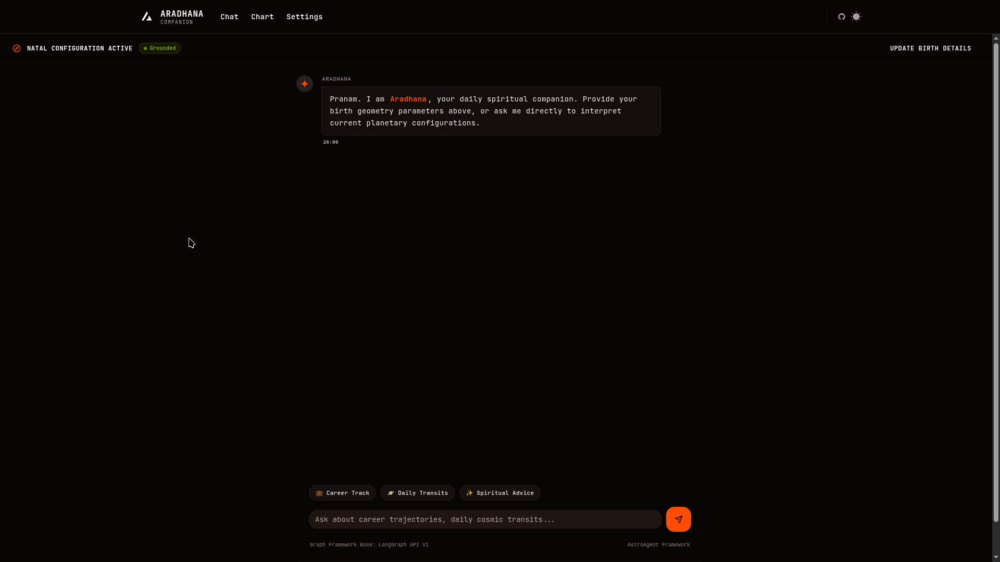
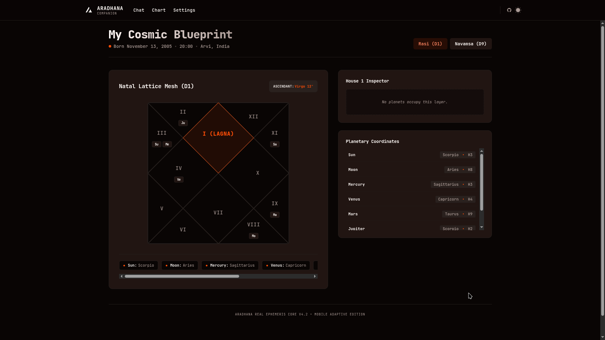
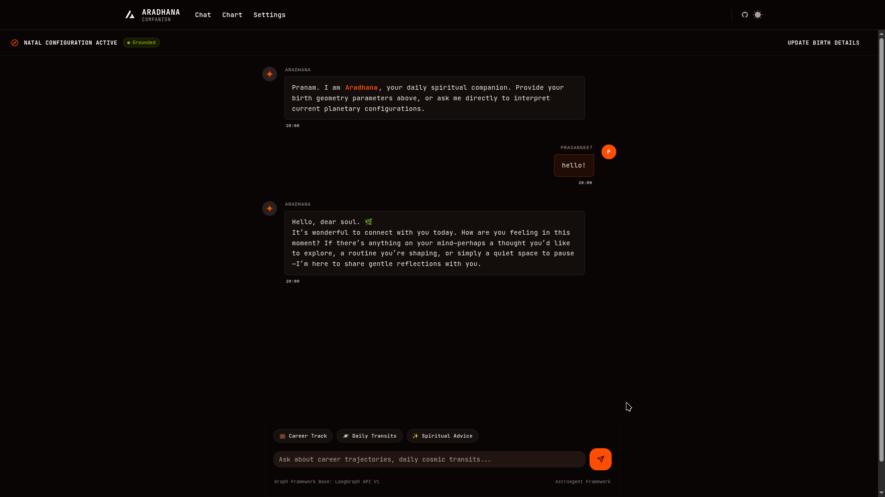
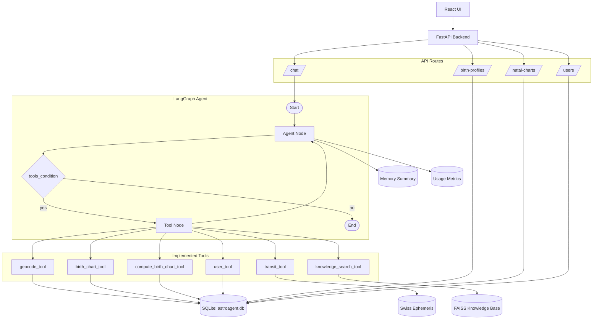
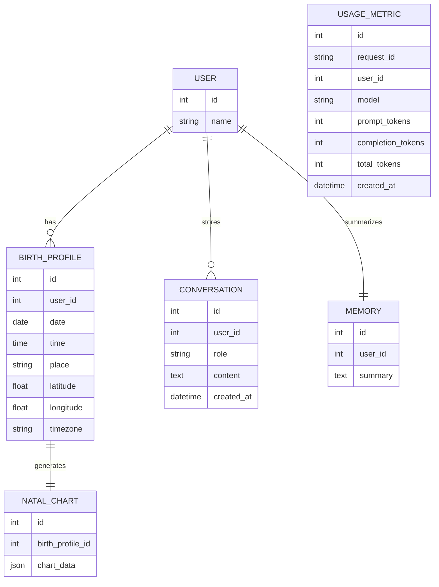

# ✦ AstroAgent

### AI-Powered Astrology Companion for the Aradhana Full-Stack Builder Assignment


## Demo

- Demo Video: [ADD_LINK_HERE](ADD_LINK_HERE)

## Screenshots









## Project Overview

AstroAgent is a conversational astrology companion built for the Aradhana full-stack assignment. A user creates a profile, adds birth details, and then asks questions about their chart, current transits, relationships, or astrology concepts. The backend uses a LangGraph agent to reason over real chart data, retrieve knowledge from a curated astrology notes base, and persist user memory for future turns.

Core user journey:

1. User creates an account and saves a birth profile.
2. The backend geocodes the birth place and computes a natal chart using real ephemeris data.
3. The user asks questions in chat.
4. The LangGraph agent decides whether to answer directly or call tools.
5. The assistant responds with grounded, warm, astrology-guided reflections.

## Features

| Feature | Status | Notes |
| --- | --- | --- |
| User creation | ✅ | Simple user record with name only |
| Birth profile creation and update | ✅ | Stores date, time, place, coordinates, and timezone |
| Real natal chart generation | ✅ | Uses Swiss Ephemeris through `pyswisseph` |
| Daily transit lookup | ✅ | Returns current planetary positions |
| Knowledge base RAG | ✅ | Loads astrology markdown notes into FAISS |
| User lookup tool | ✅ | Lets the agent retrieve the current user name |
| Long-term memory | ✅ | Summarizes recent conversation and stores it per user |
| Compatibility guidance | ✅ | Supported through chart comparison prompts and tools |
| Safety guardrails | ✅ | Guardrails are encoded in the system prompt |
| Evaluation harness | ✅ | Golden set, judge, and scorecard runner are included |
| React chat UI | ✅ | Chat workspace with onboarding modals |
| Natal chart view | ✅ | Displays Rasi and Navamsa views from stored chart data |
| Token streaming responses | ❌ | Not implemented server-side; the UI shows a local loading state |

## Tech Stack

### Backend
- FastAPI
- LangGraph
- LangChain
- `langchain-groq`
- SQLAlchemy
- SQLite
- Swiss Ephemeris (`pyswisseph`)
- Geopy
- TimezoneFinder
- FAISS
- Sentence Transformers
- Uvicorn

### Frontend
- React 19
- TypeScript
- Vite
- HeroUI
- Tailwind CSS 4
- React Router
- Axios
- React Markdown
- Recharts

### AI / Agent Framework
- LangGraph for the agent loop
- Groq-hosted chat models through LangChain
- Retrieval over a curated astrology knowledge base
- Prompt-driven safety and tone control

### Database
- SQLite database stored in `backend/astroagent.db`

### Evaluation
- Versioned golden set in JSONL
- LLM-as-judge scoring
- Tool-call matching
- Latency and reliability tracking
- Scorecard output saved to JSON

## Architecture

AstroAgent is split into a React frontend and a FastAPI backend. The backend exposes user, birth profile, natal chart, and chat routes. Chat requests enter a LangGraph workflow with an agent node and a tool node. The agent can call tools for geocoding, natal chart generation, transit lookup, astrology knowledge retrieval, and user lookup. Conversation history and memory summaries are stored in SQLite.



## Database Schema



## LangGraph Workflow

The agent state currently contains:
- `messages`
- `user_id`
- `request_id`
- `tool_calls`

Workflow summary:

1. The graph starts at the agent node.
2. The agent node loads memory, injects the system prompt, and calls the Groq model with tools bound.
3. If the model emits tool calls, LangGraph routes to the tool node.
4. Tool outputs are added back into the message state.
5. Control returns to the agent node for the next reasoning step.
6. The loop continues until no tool call is returned.

```text
Start -> Agent node -> tools_condition
                         | yes
                         v
                      Tool node -> Agent node
                         |
                         no
                         v
                        End
```

## Implemented Tools

### `geocode_tool(place: str)`

Purpose: Resolve a place name into latitude, longitude, and timezone.

Inputs:
- `place`: human-readable location string

Outputs:
- `latitude`
- `longitude`
- `timezone`

Used when:
- creating a birth profile
- updating a birth profile
- computing a natal chart for a provided location

### `birth_chart_tool(user_id: int)`

Purpose: Retrieve the current user's stored birth profile and natal chart. If the natal chart is missing, it generates and stores one.

Inputs:
- `user_id`

Outputs:
- `birth_profile`
- `natal_chart`

Used when:
- answering questions about the user's chart
- grounding interpretations in stored birth data

### `compute_birth_chart_tool(date: str, time: str, place: str)`

Purpose: Compute a natal chart from raw birth details for another person or for compatibility comparisons.

Inputs:
- `date` in `YYYY-MM-DD`
- `time` in `HH:MM`
- `place`

Outputs:
- `place`
- `latitude`
- `longitude`
- `timezone`
- `chart`

Used when:
- the user asks about a partner, friend, or family member
- the user wants compatibility analysis

### `transit_tool()`

Purpose: Return the current planetary transit positions for the current UTC date and time.

Inputs:
- none

Outputs:
- planetary longitudes and zodiac signs for the current transits

Used when:
- answering questions about “today”, “this week”, or current astrological energy

### `knowledge_search_tool(query: str)`

Purpose: Search the curated astrology knowledge base.

Inputs:
- `query`

Outputs:
- retrieved markdown chunks from the knowledge base

Used when:
- the user asks educational astrology questions
- the assistant needs grounded reference material for interpretation

### `user_tool(user_id: int)`

Purpose: Retrieve the current user’s record.

Inputs:
- `user_id`

Outputs:
- user `id`
- user `name`

Used when:
- the assistant needs to address the user by name
- the assistant needs to confirm the active user identity

## Memory System

AstroAgent stores both conversation history and a long-term summary memory.

How it works:
- Each user and assistant message is stored in the `Conversation` table.
- The `Memory` table stores one summary per user.
- On every agent run, the current memory summary is loaded and injected into the system prompt.
- After every 4 stored conversation rows for a user, the backend refreshes memory using the latest conversation messages.
- Memory summarization uses the Groq model `openai/gpt-oss-20b`.
- The generated memory is constrained to a structured format:
  - Interests
  - Goals
  - Preferences
  - Important Context

This lets the assistant remember recurring themes without replaying the full chat history every turn.

## Models Used

| Purpose | Model |
| --- | --- |
| Main agent | `openai/gpt-oss-120b` |
| Memory summarization | `openai/gpt-oss-20b` |
| Evaluation judge | `meta-llama/llama-4-scout-17b-16e-instruct` |

## Evaluation Harness

The repository includes a real evaluation harness in `backend/evals/`.
The run summary lives in [EVAL.md](./EVAL.md).

What it contains:
- `golden_set.jsonl`: 30 representative test cases
- `runner.py`: executes the agent over the golden set
- `EVAL_PROMPT`: the judge rubric used to score responses
- `results.json` and `results1.json`: saved run outputs

What it measures:
- reliability
- tool-call accuracy
- judge score
- safety score
- latency

How to run:

```bash
cd backend
python evals/runner.py
```

The runner:
1. Loads the golden set
2. Calls the agent for each case
3. Compares actual tool calls with expected tool calls
4. Uses an LLM judge for qualitative scoring
5. Writes a scorecard and saves run results to JSON

## Setup

### Backend

```bash
cd backend
uv sync
```

Create a `.env` file in `backend/` with at least:

```bash
GROQ_API_KEY=your_groq_api_key
```

Start the API:

```bash
uvicorn main:app --reload --host 0.0.0.0 --port 8000
```

### Frontend

```bash
cd frontend
npm install
npm run dev
```

The frontend expects the backend at `http://localhost:8000` by default. You can override it with `VITE_API_URL`.

## API Surface

### Backend routes
- `GET /health`
- `POST /chat/`
- `POST /users/`
- `GET /users/{user_id}`
- `POST /birth-profiles/`
- `GET /birth-profiles/{user_id}`
- `PUT /birth-profiles/{user_id}`
- `GET /natal-charts/{user_id}`

## Known Limitations

- Token streaming is not implemented over the network; the UI shows a local loading state while the backend computes a full response.
- The project uses SQLite, not PostgreSQL.
- There is no authenticated multi-user session system; identity is handled with local storage plus simple user records.
- The knowledge base is limited to the markdown files checked into `backend/knowledge/`.
- Evaluation runs depend on hosted model availability and can be affected by rate limits.
- The frontend chart view includes a derived Navamsa display when dedicated navamsa data is not returned from the backend.

## Repository Structure

```text
backend/
frontend/
backend/knowledge/
backend/evals/
```

## Notes

Astrology here is used as a reflective and conversational guide. The assistant avoids presenting readings as medical, legal, financial, or absolute life certainty.
